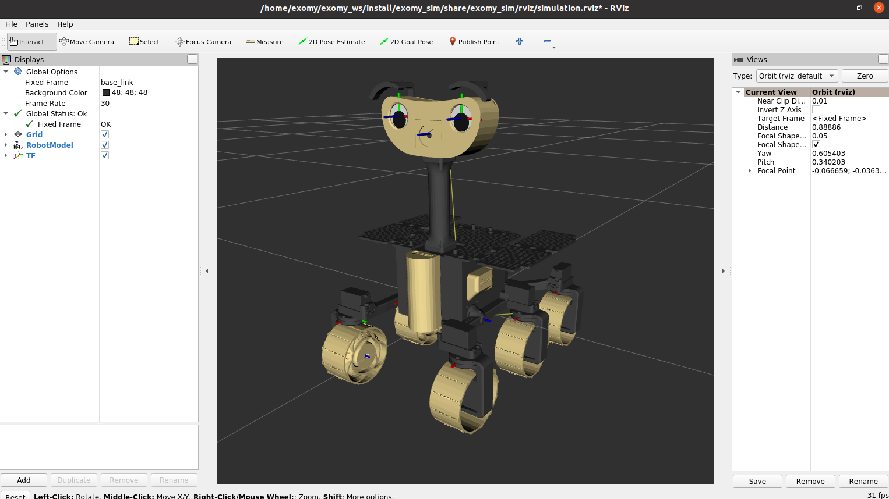

# ExoMy - Model Repository
*Disclaimer: This model and the simulation is not actively developed anymore. If you want to contribute to the project, contact us with your plans [Discord](https://discord.gg/gZk62gg).*

This repository contains a URDF representation of ExoMy, that can be used in the visualization tool rviz2 and the simulation environment Gazebo.

The software is supposed to run on a more powerful machine than the Raspberry Pi.
It was tested on a laptop with Ubuntu 20.04. 
## How to run
 
- Clone this repository `git clone https://github.com/0xD0M1M0/ExoMy_Model` next to the `ExoMy_Software` folder
- Be sure to be on the branch `ros2/foxy` on both repositories
- To allow programs being opened from within the docker container run `xhost +local:docker`
- Change to the folder `ExoMy_Model/docker`
- Start the Docker container with `docker-compose run --name exomy_sim exomy_sim`
- Inside the docker run `colcon build`
- Followed by `source install/setup.zsh`
- Launch the simulation with `ros2 launch exomy_sim_launch simulation.launch.py`
- Rviz2 and gazebo should open and you can drive around with the gamepad

- If you wanna use the web GUI you have to start another terminal in the container
- You can do that from the host with `docker exec -it exomy_sim zsh`
- Change to the directory `exomy_ws/src/exomy/gui`
- The commands to start the http-server and ros webbridge were put in a script
- Start the script with `sh run_gui.sh`
- It should show you an ip address that you can click on or copy into your browser
- The Web GUI should show up and you can use it to drive around

# Known Problems
When running on a slower system, e.g a Virtual Machine, the `spawn_entity.py` script could fail, due to a slow startup time of Gazebo.
For this case the launch file `spawn_exomy.launch.py` is provided.
To use it the line `spawn_rover` in the `return LaunchConfiguration()` needs to be commented out.
Then the `simulation.launch.py` can be run.
When Gazebo is launched properly the `spawn_exomy.launch.py` can be run.

# ExoMy Links

### [Website](https://esa-prl.github.io/ExoMy/)

### [Wiki](https://github.com/0xD0M1M0/ExoMy/wiki)

### [Documentation Repository](https://github.com/0xD0M1M0/ExoMy)

### [Software Repository](https://github.com/0xD0M1M0/ExoMy_Software)

### Social Media
<!-- Add icon library -->
<link rel="stylesheet" href="https://use.fontawesome.com/releases/v5.13.1/css/all.css">

<!-- Add font awesome icons -->

    
    <a href="https://discord.gg/gZk62gg"> Join the Community!</a>  

    
    <a href="https://twitter.com/exomy_rover"> @ExoMy_Rover</a> 

    
    <a href="https://www.instagram.com/exomy_rover/"> @ExoMy_Rover</a>

